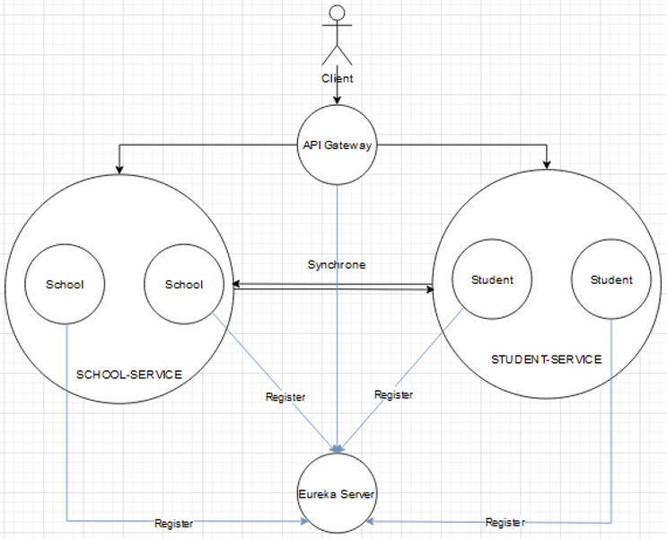
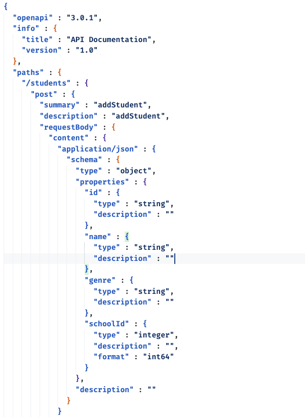
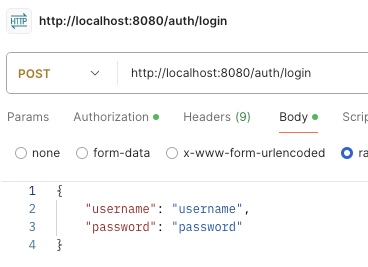
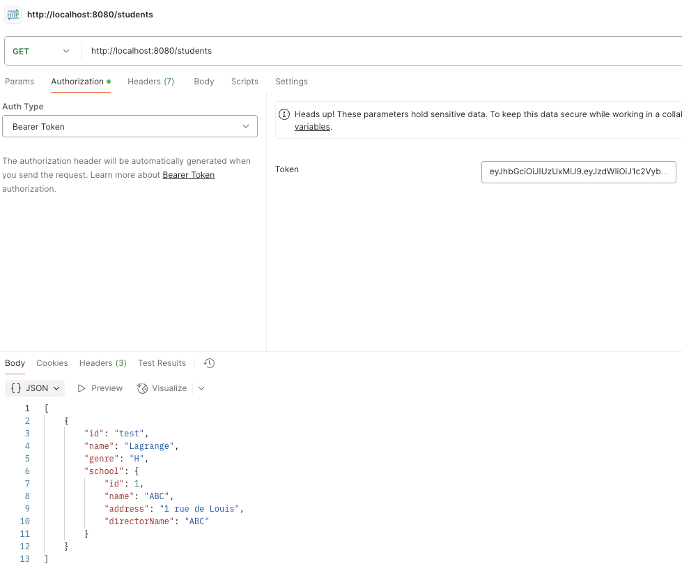

# Exercice Microservices - Renforcement Back End M2

## Prérequis

- Avoir installé Docker
- Avoir installé une JDK 23
- Avoir installé Maven

(Les deux derniers prérequis sont déjà installés localement dans IntelliJ IDEA)

**IMPORTANT**: Les secrets utilisés sont uniquement fait pour tester l'application directement sans recréer les application.properties en local.

## Lancer les bases de données

**IMPORTANT**: Les bases de données postgres doivent être créés à la main (avec IntelliJ Database ou PGAdmin) car elles ne sont pas créées automatiquement depuis le docker compose.

```bash
docker compose up
```

## Lancer les microservices

- Lancer les microservices dans l'ordre suivant :

```bash
cd eureka && mvn clean && mvn install && mvn spring-boot:run
```

```bash
cd gateway && mvn clean && mvn install && mvn spring-boot:run
```

```bash
cd auth && mvn clean && mvn install && mvn spring-boot:run
```

```bash
cd school && mvn clean && mvn install && mvn spring-boot:run
```

```bash
cd student && mvn clean && mvn install && mvn spring-boot:run
```

## Configuration des microservices et infrastructure logiciel



Les microservices sont configurés pour tourner sur des ports aléatoires de façon à pouvoir lancer plusieurs instances d'un même microservice.

**IMPORTANT : Les endpoints API sont exportés en format JSON dans les répertoires docs de chaque microservice**

- Preview pour le microservice students : 



- Exemple pour appeler le premier endpoint de `Students` après avoir setup Eureka, l'API Gateway et l'authentification :

### Récupérer le token JWT de l'utilisateur en se connectant :



### Appeler l'endpoint en passant le JWT dans le header en bearer :



## Eureka

Le serveur Eureka permet de rendre les urls des différentes instances des microservices génériques.
Une fois une instance lancée, elle s'enregistre sur le serveur Eureka. Elle est alors considérée comme client Eureka.

Exemple :

- La première instance du microservice `School` tourne sur le port 8081 (port aléatoire)
- Le seconde instance du microservice `School` tourne sur le port 8082 (port aléatoire)

Le serveur Eureka permet de rendre les urls des microservices génériques.

- On a donc une url interne générique dans l'infrastructure pour accéder à l'une des instances du microservice `School` : `http://school/schools/`

## API Gateway

Le serveur API Gateway permet de rediriger les requêtes des clients centralisée sur une application (le middleware, ici le gateway) vers les instances des microservices.
La gateway utilise les urls génériques d'Eureka pour rediriger les requêtes.

Exemple :

- Toutes les requêtes qui comprennent le chemin `/schools` sont redirigées vers le microservice `School` avec son identifiant de load balancing : `lb://school` (possible grâce à Eureka)

L'API Gateway avec la dépendance Spring Cloud Gateway fonctionne par défaut en Round Robin (Instance 1 -> Instance 2 -> Instance 3 -> Instance 1 -> ...).

## Authentification

Le microservice `Authentification` permet de gérer l'authentification des utilisateurs.

Ce microservice est accessible par l'API Gateway à l'adresse `http://localhost:8080/auth` (le port de la gateway est 8080).

Il renvoie un token JWT qui permet d'authentifier l'utilisateur.

Ce JWT est traité avec des filters dans le middleware de l'API Gateway pour vérifier l'authentification de l'utilisateur. 

Les différents microservices sont donc uniquement accessibles si l'utilisateur est authentifié avec un JWT.
