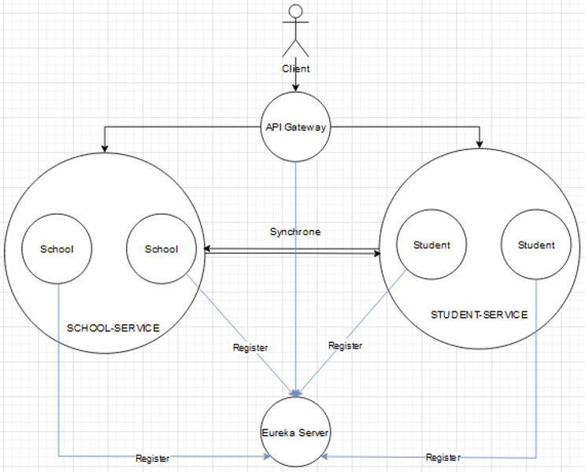

# Exercice Microservices - Renforcement Back End M2

## Configuration des microservices et infrastructure logiciel

## Eureka

Le serveur Eureka permet de rendre les urls des différentes instances des microservices génériques.
Une fois une instance lancée, elle s'enregistre sur le serveur Eureka. Elle est alors considérée comme client Eureka.

Exemple :

- La première instance du microservice `School` tourne sur le port 8081
- Le seconde instance du microservice `School` tourne sur le port 8082

Le serveur Eureka permet de rendre les urls des microservices génériques.

- On a donc une url interne générique dans l'infrastructure pour accéder à l'une des instances du microservice `School` : `http://school/schools/`

## API Gateway

Le serveur API Gateway permet de rediriger les requêtes des clients vers les instances des microservices.

Exemple :

- Toutes les requêtes qui comprennent le chemin `/schools` sont redirigées vers le microservice `School` avec son identifiant de load balancing : `lb://school`

L'API Gateway avec la dépendance Spring Cloud Gateway fonctionne par défaut en Round Robin (Instance 1 -> Instance 2 -> Instance 3 -> Instance 1 -> ...).

## Authentification

Le microservice `Authentification` permet de gérer l'authentification des utilisateurs.

Ce microservice est accessible par l'API Gateway à l'adresse `http://localhost:8080/auth` (le port de la gateway est 8080).

Il renvoie un token JWT qui permet d'authentifier l'utilisateur.

Ce JWT est traité avec des filters dans le middleware de l'API Gateway pour vérifier l'authentification de l'utilisateur. 

Les différents microservices sont donc uniquement accessibles si l'utilisateur est authentifié avec un JWT.